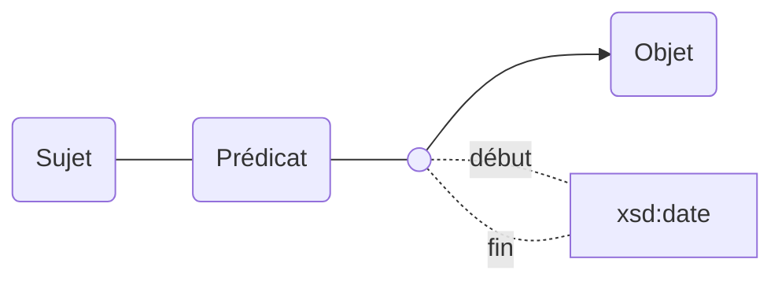
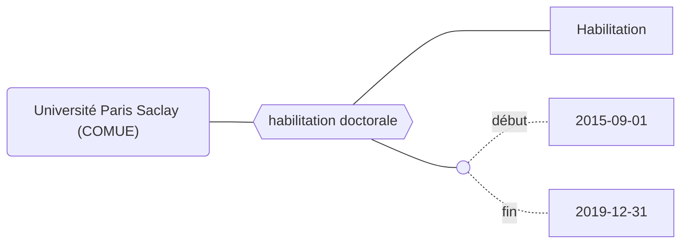

Les propriétés de la modélisation Movies peuvent être bornées dans le temps grâce aux propriétés `début` et `fin`.

## Modélisation

## Propriétés

| **Propriétés**               | ***Domain*** | ***Range*** |
| ---------------------------- | ------------ | ----------- |
| [début](Propriétés/début.md) |              | xsd:date    |
| [fin](Propriétés/fin.md)     |              | xsd:date    |

:::caution

### Listes des propriétés ne pouvant pas être bornées chronologiquement

**Les propriétés internes à l'ontologie : **
* instance de
* sous classe de
* sous propriété de

**Les propriétés relatives aux dates :**
* début
* fin
* fin application
* début application
* suppression

**Les identifiants :**
* code uai
* création
* identifiant siren
* identifiant siret
* identifiant idref
* identifiant rsnr
* identifiant wikidata
* identifiant hal
* identifiant legifrance
* identifiant paysage
* identifiant scanr
* identifiant contrat
* uri

**autre :**
* forme juridique (le changement de forme juridique entraîne la création d'une nouvelle entité)
:::

## Exemple : L'habilitation de l'Université Paris Saclay (COMUE) à délivrer le doctorat

