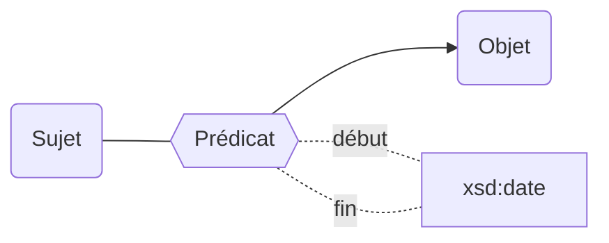
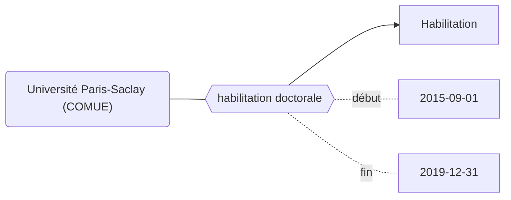

Les propriétés de la modélisation Movies peuvent être bornées dans le temps grâce aux propriétés `début` et `fin`.

## Modélisation

## Propriétés

| **Propriétés**               | ***Domain*** | ***Range*** |
| ---------------------------- | ------------ | ----------- |
| [début](Propriétés/début.md) |              | xsd:date    |
| [fin](Propriétés/fin.md)     |              | xsd:date    |

:::caution

### Listes des ropriétés ne pouvant pas être bornées chronologiquement

**Les propriétés internes à l'ontologie : **
* [instance de](Propriétés/instance%20de.md)
* [sous classe de](Propriétés/sous%20classe%20de.md)
* [sous propriété de](Propriétés/sous%20propriété%20de.md)

**Les propriétés relatives aux dates :**
* [début](Propriétés/début.md)
* [fin](Propriétés/fin.md)
* [fin application](Propriétés/fin%20application.md)
* [début application](Propriétés/début%20application.md)
* [suppression](Propriétés/suppression.md)

**Les identifiants :**
* [code uai](Propriétés/code%20uai.md)
* [création](Propriétés/création.md)
* [identifiant siren](Propriétés/identifiant%20siren.md)
* [identifiant siret](Propriétés/identifiant%20siret.md)
* [identifiant idref](Propriétés/identifiant%20idref.md)
* [identifiant rsnr](Propriétés/identifiant%20rsnr.md)
* [identifiant wikidata](Propriétés/identifiant%20wikidata.md)
* [identifiant hal](Propriétés/identifiant%20hal.md)
* [identifiant legifrance](Propriétés/identifiant%20legifrance.md)
* [identifiant paysage](Propriétés/identifiant%20paysage.md)
* [identifiant scanr](Propriétés/identifiant%20scanr.md)
* [identifiant contrat](Propriétés/identifiant%20contrat.md)
* [uri](Propriétés/uri.md)

**autre :**
* forme juridique (le changement de forme juridique entraîne la création d'une nouvelle entité)
:::

## Exemple : L'habilitation de l'Université Paris-Saclay (COMUE) à délivrer le doctorat

