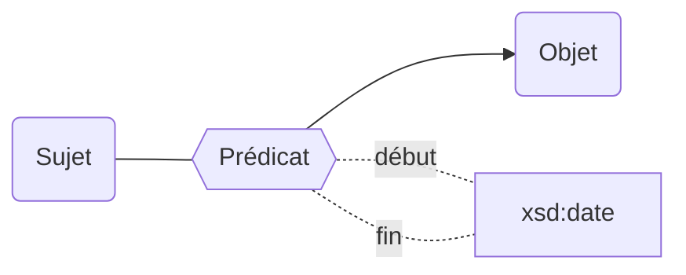

Les propriétés de la modélisation Movies peuvent être bornées dans le temps grâce aux propriétés [`début`](../Ontologie/Propriétés/début.md) et [`fin`](../Ontologie/Propriétés/fin.md).

## Modélisation

## Propriétés

| **Propriétés**                            | ***Domain*** | ***Range*** |
| ----------------------------------------- | ------------ | ----------- |
| [début](../Ontologie/Propriétés/début.md) |              | xsd:date    |
| [fin](../Ontologie/Propriétés/fin.md)     |              | xsd:date    |

:::caution

### Listes des ropriétés ne pouvant pas être bornées chronologiquement

**Les propriétés internes à l'ontologie : **
* [instance de](../Ontologie/Propriétés/instance%20de.md)
<!-- * [sous classe de](../Ontologie/Propriétés/sous%20classe%20de.md) -->
<!-- * [sous propriété de](../Ontologie/Propriétés/sous%20propriété%20de.md) -->

**Les propriétés relatives aux dates :**
* [début](../Ontologie/Propriétés/début.md)
* [fin](../Ontologie/Propriétés/fin.md)
* [fin application](../Ontologie/Propriétés/fin%20application.md)
* [début application](../Ontologie/Propriétés/début%20application.md)
* [suppression](../Ontologie/Propriétés/suppression.md)

**Les identifiants :**
* [code uai](../Ontologie/Propriétés/code%20uai.md)
* [création](../Ontologie/Propriétés/création.md)
* [identifiant siren](../Ontologie/Propriétés/identifiant%20siren.md)
* [identifiant siret](../Ontologie/Propriétés/identifiant%20siret.md)
* [identifiant idref](../Ontologie/Propriétés/identifiant%20idref.md)
* [identifiant rsnr](../Ontologie/Propriétés/identifiant%20rnsr.md)
* [identifiant wikidata](../Ontologie/Propriétés/identifiant%20wikidata.md)
* [identifiant hal](../Ontologie/Propriétés/identifiant%20hal.md)
* [identifiant legifrance](../Ontologie/Propriétés/identifiant%20legifrance.md)
* [identifiant paysage](../Ontologie/Propriétés/identifiant%20paysage.md)
* [identifiant scanr](../Ontologie/Propriétés/identifiant%20scanr.md)
* [identifiant contrat](../Ontologie/Propriétés/identifiant%20contrat.md)
* [uri](../Ontologie/Propriétés/uri.md)

**autre :**
* forme juridique (le changement de forme juridique entraîne la création d'une nouvelle entité)
:::

## Exemple : Les bornes chronologique de l'habilitation de la COMUE Paris-Saclay à délivrer le doctorat

<Claim property="habilitation doctorale">
    <Statement value="Habilitation doctorale">
        

            <Qualifier property="début">1 septembre 2015</Qualifier>
            <Qualifier property="fin">31 décembre 2019</Qualifier>
        

        <References>
            <Reference>
                <ReferenceElement property="source">STHE</ReferenceElement>
            </Reference>
        </References>
    </Statement>
</Claim>
