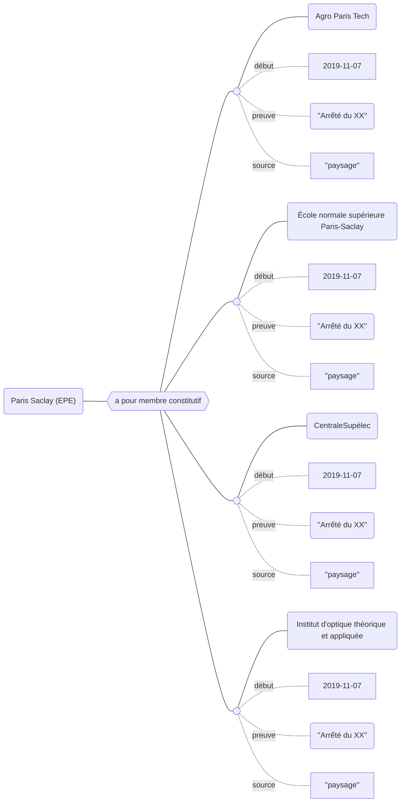

## Modélisation

## Propriétés

Les propriétés suivantes peuvent être utilisées pour rendre compte de la compisition d'un établissement :

| Propriétés                                                                                                               | *Domain*     | *Range*      | **Cardinalité** |
| ------------------------------------------------------------------------------------------------------------------------ | ------------ | ------------ | --------------- |
| [a pour membre](Propriétés/a%20pour%20membre.md) `début, fin, preuve, source`                                 | Organisation | Organisation | F/R             |
| [est membre de](Propriétés/est%20membre%20de.md) `début, fin, preuve, source`                                 | Organisation | Organisation | F/R             |
| [a pour membre constitutif](Propriétés/a%20pour%20membre%20constitutif.md) `début, fin, preuve, source`       | EPE          | Organisation | F/R             |
| [est membre constitutif](Propriétés/est%20membre%20constitutif.md) de `début, fin, preuve, source`            | Organisation | Organisation | F/?             |
| [a pour membre associé](Propriétés/a%20pour%20membre%20associé.md) `début, fin, preuve, source`               | EPE          | Organisation | F/R             |
| [est membre associé de](Propriétés/est%20membre%20associé%20de.md) `début, fin, preuve, source`               | Organisation | Organisation | F/?             |
| [a pour établissement support](Propriétés/a%20pour%20établissement%20support.md) `début, fin, preuve, source` | Organisation | Organisation | F/?             |
| [est établissement support de](Propriétés/est%20établissement%20support%20de.md) `début, fin, preuve, source` | Organisation | Organisation | F/R             |

Chacune des propriétés listées ci-dessus peut être bornée dans le temps avec les propriétés [`début`](Propriétés/début.md) et [`fin`](Propriétés/fin.md). Chacune des assertions peut être complétée par une preuve et une source.

## Exemple : Les membres constitutifs de l'EPE Paris Saclay

