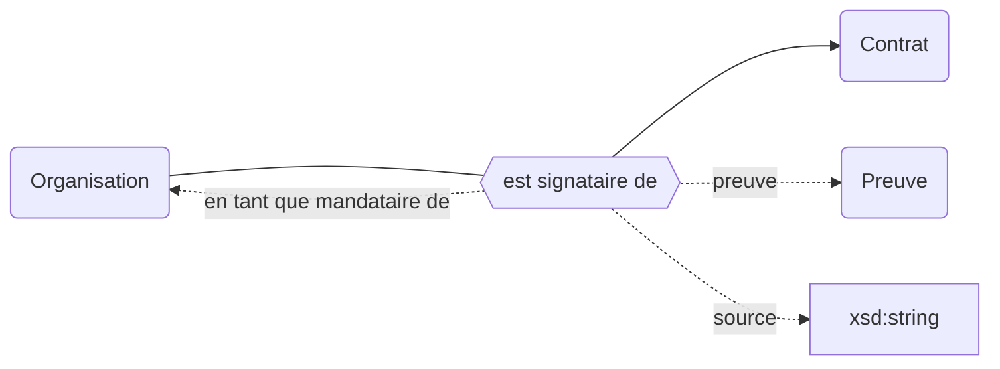
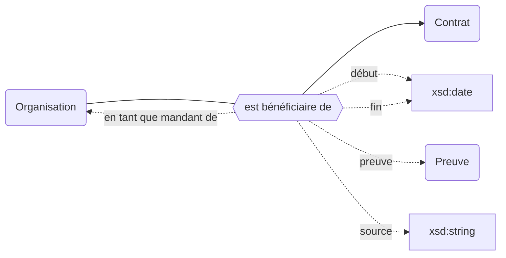
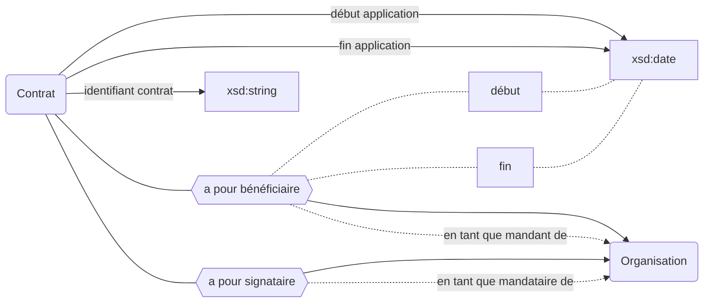

## Modélisation

### Signataires



### Bénéficiaires



### Déscription du contrat



## Propriétés


| **Propriétés**                                                                            | ***Domain***                                                                                  | ***Range***                                                       | **Cardinalité** | **Qualificatifs**                                            |
| ----------------------------------------------------------------------------------------- | --------------------------------------------------------------------------------------------- | ----------------------------------------------------------------- | --------------- | ------------------------------------------------------------ |
| [est signataire de](../Ontologie/Propriétés/est%20signataire%20de.md)                     | [Organisation](../Ontologie/Classes/Organisation/Organisation.md)                             | [Contrat](../Ontologie/Classes/Preuve/Contrat.md)                 | F/R             | `en tant que mandataire de`, `preuve`, `source`              |
| [est bénéficiaire de](../Ontologie/Popriétés/est%20bénéficiaire%20de.md)                  | [Organisation](../Ontologie/Classes/Organisation/Organisation.md)                             | [Contrat](../Ontologie/Classes/Preuve/Contrat.md)                 | F/R             | `en tant que mandant de`, `preuve`, `source`, `début`, `fin` |
| [en tant que mandataire de](../Ontologie/Propriétés/en%20tant%20que%20mandataire%20de.md) | [est signataire de](../Ontologie/Propriétés/est%20signataire%20de.md)                         | [Organisation](../Ontologie/Classes/Organisation/Organisation.md) | F/R             |                                                              |
| [en tant que mandant de](../Ontologie/Propriétés/en%20tant%20que%20mandant%20de.md)       | [est bénéficiaire de](../Ontologie/Propri%C3%A9t%C3%A9s/est%20b%C3%A9n%C3%A9ficiaire%20de.md) | [Organisation](../Ontologie/Classes/Organisation/Organisation.md) | F/R             |                                                              |
| [identifiant contrat](../Ontologie/Propriétés/identifiant%20contrat.md)                   | [Contrat](../Ontologie/Classes/Preuve/Contrat.md)                                             | xsd:date                                                          | F/NR            |                                                              |
| [début application](../Ontologie/Propriétés/début%20application.md)                       | Preuve                                                                                        | xsd:date                                                          | F/NR            |                                                              |
| [fin application](../Ontologie/Propriétés/fin%20application.md)                           | Preuve                                                                                        | xsd:date                                                          | F/NR            |                                                              |

## Définition

Date de début d'application d'un texte réglementaire ou d'un contrat


## Exemple : Les contrats de documentation électronique de Paris 11

## Cas d'usage

### Faire une synthèse des contrats de documentation électronique

```sparql
SELECT ?item ?itemLabel ?début ?fin
WHERE 
{
  ?item wdt:P1 wd:Q7.
  SERVICE wikibase:label { bd:serviceParam wikibase:language "[AUTO_LANGUAGE],en". }
  
  OPTIONAL {
   ?item wdt:P12 ?début 
  }
  
  OPTIONAL {
   ?item wdt:P13 ?fin
  }
}
```

### Lister les contrats de documentation électronique en cours

```sparql
SELECT ?item ?itemLabel ?début ?fin
WHERE 
{
  ?item wdt:P1 wd:Q7.
  SERVICE wikibase:label { bd:serviceParam wikibase:language "[AUTO_LANGUAGE],en". }
  
  OPTIONAL {
   ?item wdt:P12 ?début 
  }
  
  OPTIONAL { 
   ?item wdt:P13 ?fin
  }
  
  FILTER(?fin > NOW())
}
```

### Lister les contrats de documentation électroniques échus

```sparql
SELECT ?item ?itemLabel ?début ?fin
WHERE 
{
  ?item wdt:P1 wd:Q7.
  SERVICE wikibase:label { bd:serviceParam wikibase:language "[AUTO_LANGUAGE],en". }
  
  OPTIONAL {
   ?item wdt:P12 ?début 
  }
  
   ?item wdt:P13 ?fin
   FILTER(?fin < NOW()) 
}
```

### Lister les contrats signés par l'Université Paris 11

```sparql
SELECT ?item ?itemLabel ?début ?fin
WHERE 
{
  ?item wdt:P1 wd:Q7;
    wdt:P24 wd:Q8650. # Paris 11
  
  OPTIONAL {
   ?item wdt:P12 ?début 
  }
  
  OPTIONAL {
   ?item wdt:P13 ?fin
  }
  
  SERVICE wikibase:label { bd:serviceParam wikibase:language "[AUTO_LANGUAGE],en". } # le label viendra de préférence dans votre langue, et autrement en anglais
}
```

### Retrouver les héritiers d'un contrat

Cette requête permet de retrouver l’héritier d’un contrat (en partant des signataires). Il faudrait dans la réalité prendre en compte tous les bénéficiaires.

Sont considérés comme héritiers les successeurs non morts.

```sparql
SELECT ?beneficiairesLabel WHERE {
  { SELECT ?ben WHERE { wd:Q10505 wdt:P24 ?ben. } } # Signataires
  UNION
  { SELECT ?ben WHERE { wd:Q10505 wdt:P22 ?ben. } } # Bénéficiaires
  {
    SELECT * WHERE {
      { FILTER(NOT EXISTS { ?ben wdt:P19 ?date_suppression. }) } # Bénéficiaires directs toujours en vie (qui n'a pas de date de mort)
      UNION
      {
        ?ben wdt:P19 ?date_suppression; # Héritiers des bénéficiaires morts (qui a une date de mort)
          (wdt:P52*) ?successeur.
        FILTER(NOT EXISTS { ?successeur wdt:P19 ?date_suppression. }) # On enlève les héritiers morts
        
        BIND(?successeur AS ?beneficiaires_indirects)
      }
    }
  }
  BIND(IF(BOUND(?beneficiaires_indirects), ?beneficiaires_indirects, ?ben) AS ?beneficiaires)
  SERVICE wikibase:label { bd:serviceParam wikibase:language "[AUTO_LANGUAGE],en". }
}
```