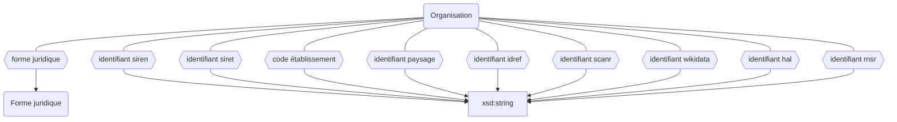

## Modélisation




## Classes

Les établissements sont une instance de l'une des classes ci-dessous :

```
Organisation
    ├─ Université
    ├─ PRES
    ├─ COMUE
    ├─ EPE
    ├─ Campus
    ├─ Centre de calcul
    ├─ Centre hospitalier universitaire
    ├─ Grand établissement
    ├─ Consortium universitaire
    ├─ Équipe de recherche
    ├─ Écoles
    │	├─ École doctorale
    │	├─ École d’architecture
    │	├─ École d’arts
    │	├─ École militaire
    │	├─ École d’ingénieurs
    │	├─ École vétérinaire
    │	├─ École de commerce
    │	├─ École normale
    │	├─ École arts appliqués
    │	╰─ École de formation
    ╰─ Instituts
        ├─ Institut d’études politiques
        ├─ Institut de recherche
        ├─ Institut de formation
        ├─ Institut national de physique
        ╰─ Institut National Polytechnique
```

<details>
<summary>La liste des sous classes d'organisation peut être retrouvée grâce à la requête suivante</summary>
<div>


```rq title="sous-classes-organisation.rq"
SELECT ?sous_classesLabel WHERE {
?sous_classes wdt:P2* wd:Q1 
SERVICE wikibase:label { bd:serviceParam wikibase:language "[AUTO_LANGUAGE],en". }
}
```


</div>
</details>

## Propriétés

Les établissements peuvent être décrit avec les propriétés suivantes :

| **Propriétés**                                                            | ***Domain***                                                      | ***Range***     | **Cardinalité**             | **Qualificatifs**                                                                                                                                                                  |
| ------------------------------------------------------------------------- | ----------------------------------------------------------------- | --------------- | --------------------------- | ---------------------------------------------------------------------------------------------------------------------------------------------------------------------------------- |
| [nom](../Ontologie/Propriétés/nom.md)                                     | [Organisation](../Ontologie/Classes/Organisation/Organisation.md) | xsd:string      | O/R                         | [`début`](../Ontologie/Propriétés/début.md), [`fin`](../Ontologie/Propriétés/fin.md), [`preuve`](../Ontologie/Propriétés/preuve.md), [`source`](../Ontologie/Propriétés/source.md) |
| [sigle](../Ontologie/Propriétés/sigle.md)                                 | [Organisation](../Ontologie/Classes/Organisation/Organisation.md) | xsd:string      | F/R                         | [`début`](../Ontologie/Propriétés/début.md), [`fin`](../Ontologie/Propriétés/fin.md), [`preuve`](../Ontologie/Propriétés/preuve.md), [`source`](../Ontologie/Propriétés/source.md) |
| [forme juridique](../Ontologie/Propriétés/forme%20juridique.md)           | [Organisation](../Ontologie/Classes/Organisation/Organisation.md) | Forme Juridique | F/NR                        |                                                                                                                                                                                    |
| [identifiant siren](../Ontologie/Propriétés/identifiant%20siren.md)       | [Organisation](../Ontologie/Classes/Organisation/Organisation.md) | xsd:string      | F/NR                        |                                                                                                                                                                                    |
| [identifiant siret](../Ontologie/Propriétés/identifiant%20siret.md)       | [Organisation](../Ontologie/Classes/Organisation/Organisation.md) | xsd:string      | F/NR                        |                                                                                                                                                                                    |
| [code établissement](../Ontologie/Propriétés/code%20établissement.md)     | [Organisation](../Ontologie/Classes/Organisation/Organisation.md) | xsd:string      | F/NR                        |                                                                                                                                                                                    |
| [identifiant paysage](../Ontologie/Propriétés/identifiant%20paysage.md)   | [Organisation](../Ontologie/Classes/Organisation/Organisation.md) | xsd:string      | F/NR                        |                                                                                                                                                                                    |
| [identifiant idref](../Ontologie/Propriétés/identifiant%20idref.md)       | [Organisation](../Ontologie/Classes/Organisation/Organisation.md) | xsd:string      | F/? (en cas de renommage ?) |                                                                                                                                                                                    |
| [identifiant scanr](../Ontologie/Propriétés/identifiant%20scanr.md)       | [Organisation](../Ontologie/Classes/Organisation/Organisation.md) | xsd:string      | F/NR                        |                                                                                                                                                                                    |
| [identifiant wikidata](../Ontologie/Propriétés/identifiant%20wikidata.md) | [Organisation](../Ontologie/Classes/Organisation/Organisation.md) | xsd:string      | F/NR?                       |                                                                                                                                                                                    |
| [identifiant hal](../Ontologie/Propriétés/identifiant%20hal.md)           | [Organisation](../Ontologie/Classes/Organisation/Organisation.md) | xsd:string      | F/NR                        |                                                                                                                                                                                    |
| [identifiant rnsr](../Ontologie/Propriétés/identifiant%20rnsr.md)         | [Organisation](../Ontologie/Classes/Organisation/Organisation.md) | xsd:string      | F/NR                        |                                                                                                                                                                                    |


