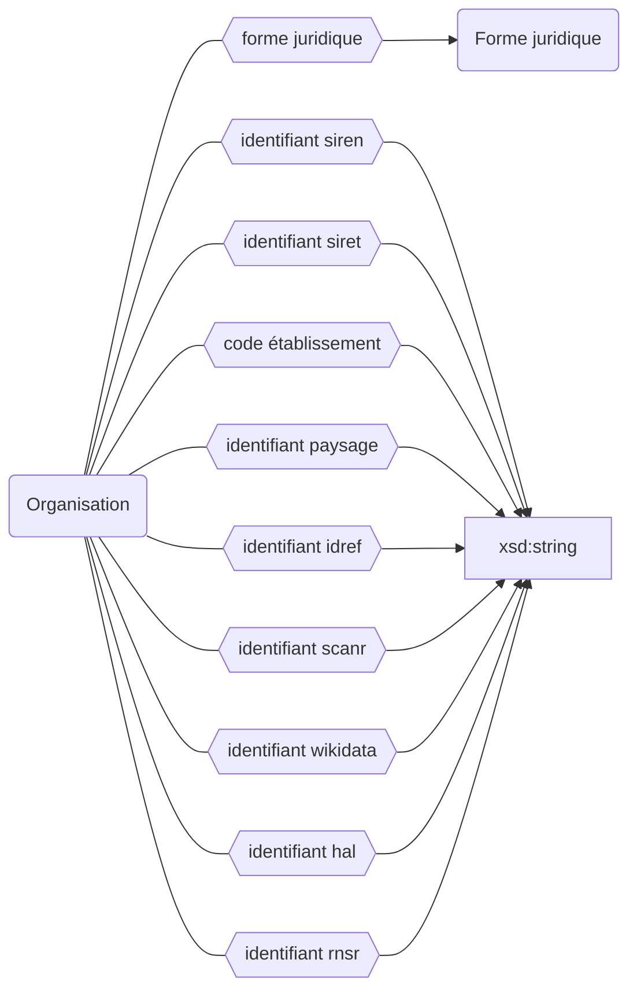

## Modélisation




## Classes

Les établissements sont une instance de l'une des classes ci-dessous :

```
Organisation
    ├─ Université
    ├─ PRES
    ├─ COMUE
    ├─ EPE
    ├─ Campus
    ├─ Centre de calcul
    ├─ Centre hospitalier universitaire
    ├─ Grand établissement
    ├─ Consortium universitaire
    ├─ Équipe de recherche
    ├─ Écoles
    │	├─ École doctorale
    │	├─ École d’architecture
    │	├─ École d’arts
    │	├─ École militaire
    │	├─ École d’ingénieurs
    │	├─ École vétérinaire
    │	├─ École de commerce
    │	├─ École normale
    │	├─ École arts appliqués
    │	╰─ École de formation
    ╰─ Instituts
        ├─ Institut d’études politiques
        ├─ Institut de recherche
        ├─ Institut de formation
        ├─ Institut national de physique
        ╰─ Institut National Polytechnique
```

<details>
<summary>La liste des sous classes d'organisation peut être retrouvée grâce à la requête suivante</summary>
<div>


```rq title="sous-classes-organisation.rq"
SELECT ?sous_classesLabel WHERE {
?sous_classes wdt:P2* wd:Q1 
SERVICE wikibase:label { bd:serviceParam wikibase:language "[AUTO_LANGUAGE],en". }
}
```


</div>
</details>

## Propriétés

Les établissements peuvent être décrit avec les propriétés suivantes :

| **Propriétés**                                                    | ***Domain*** | ***Range***    | **Cardinalité**             |
| ----------------------------------------------------------------- | ------------ | -------------- | --------------------------- |
| [nom](Propriétés/nom.md) <sup><sup>`début`, `fin`</sup></sup>     | Organisation | xsd:string     | O/R                         |
| [sigle](Propriétés/sigle.md) <sup><sup>`début`, `fin`</sup></sup> | Organisation | xsd:string     | F/R                         |
| [forme juridique](Propriétés/forme%20juridique.md)                | Organisation | FormeJuridique | F/NR                        |
| [identifiant siren](Propriétés/identifiant%20siren.md)            | Organisation | xsd:string     | F/NR                        |
| [identifiant siret](Propriétés/identifiant%20siret.md)            | Organisation | xsd:string     | F/NR                        |
| [code établissement](Propriétés/code%20établissement.md)          | Organisation | xsd:string     | F/NR                        |
| [identifiant paysage](Propriétés/identifiant%20paysage.md)        | Organisation | xsd:string     | F/NR                        |
| [identifiant idref](Propriétés/identifiant%20idref.md)            | Organisation | xsd:string     | F/? (en cas de renommage ?) |
| [identifiant scanr](Propriétés/identifiant%20scanr.md)            | Organisation | xsd:string     | F/NR                        |
| [identifiant wikidata](Propriétés/identifiant%20wikidata.md)      | Organisation | xsd:string     | F/NR?                        |
| [identifiant hal](Propriétés/identifiant%20hal.md)                | Organisation | xsd:string     | F/NR                        |
| [identifiant rnsr](Propriétés/identifiant%20rnsr.md)              | Organisation | xsd:string     | F/NR                        |


