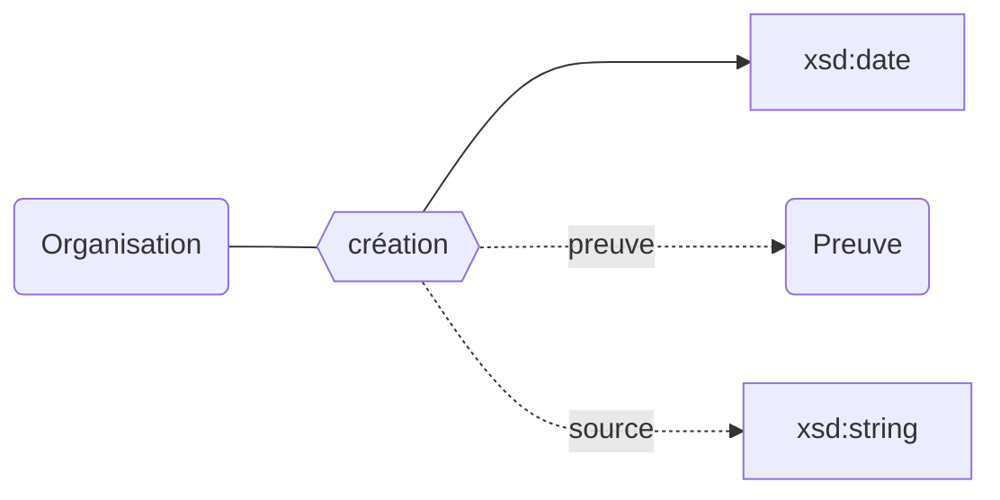
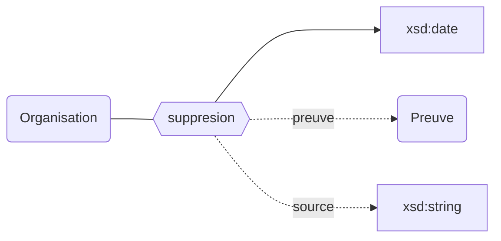
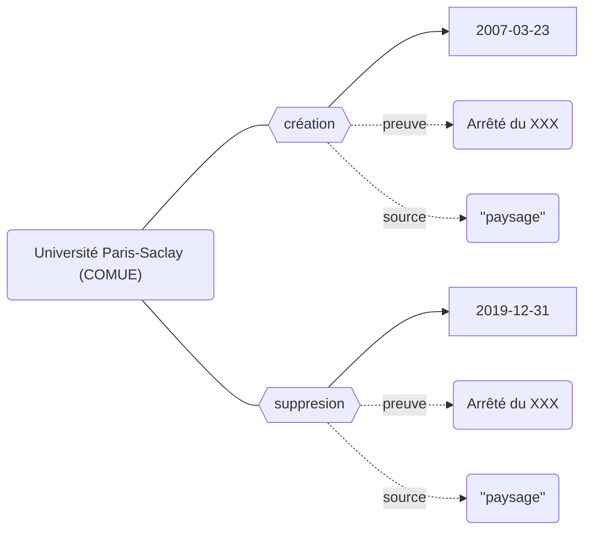

## Modélisation

### Création

### Suppression

## Propriétés

L'existence des établissements peut être décrit avec les propriétés suivantes :

| **Propriétés**                                        | ***Domain***                                                      | ***Range*** | ***Cardinalité*** | **Qualificatifs**  |
| ----------------------------------------------------- | ----------------------------------------------------------------- | ----------- | ----------------- | ------------------ |
| [création](../Ontologie/Propriétés/création.md)       | [Organisation](../Ontologie/Classes/Organisation/Organisation.md) | xsd:date    | O/NR              | `preuve`, `source` |
| [suppression](../Ontologie/Propriétés/suppression.md) | [Organisation](../Ontologie/Classes/Organisation/Organisation.md) | xsd:date    | F/NR              | `preuve`, `source` |

## Exemple : L'existence de la Comue Paris-Saclay

