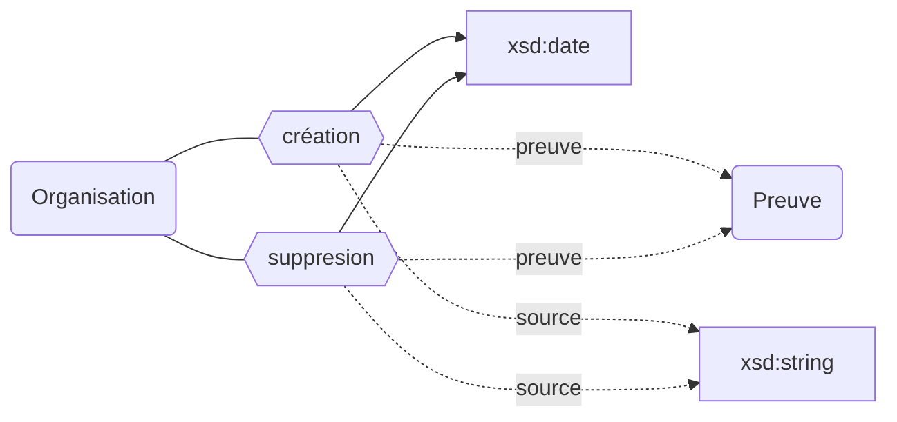
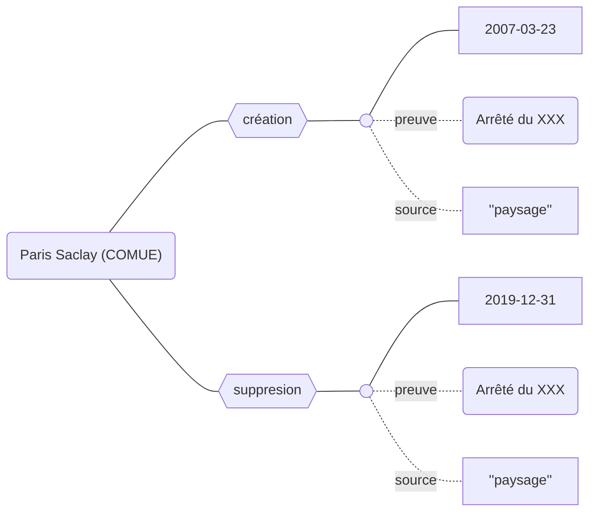

## Modélisation

## Propriétés

L'existence des établissements peut être décrit avec les propriétés suivantes :

| **Propriétés**                          | ***Domain*** | ***Range*** | ***Cardinalité*** |
| --------------------------------------- | ------------ | ----------- | ----------------- |
| création `preuve, source`    | Organisation | xsd:date    | O/NR              |
| suppression `preuve, source` | Organisation | xsd:date    | F/NR              |

## Exemple : L'existence de la Comue Paris Saclay

:::caution
Les propriétés `création` et `suppression` ne peuvent être appliquées qu'une seul fois. Pour un établissement donné il n'existe qu'une seul date de création et de suppression.
:::