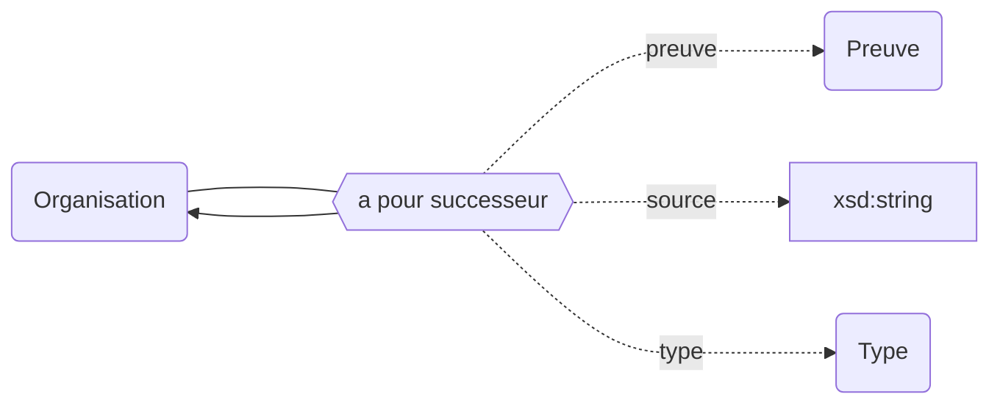
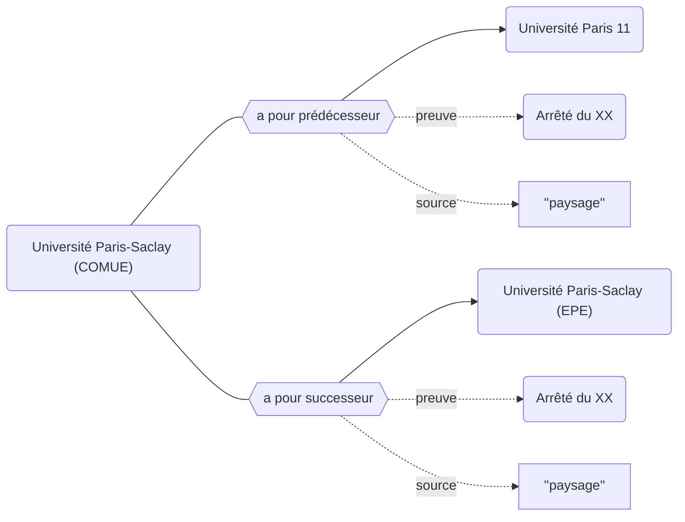

## Modélisation

## Prédécesseurs


## Successeurs



## Propriétés

| **Propriétés**                                                            | ***Domain***                                       | ***Range***                                                       | ***Cardinalité*** | **Qualificatifs**          |
| ------------------------------------------------------------------------- | -------------------------------------------------- | ----------------------------------------------------------------- | ----------------- | -------------------------- |
| [a pour prédécesseur](../Ontologie/Propriétés/a%20pour%20prédécesseur.md) | [Organisation](../Ontologie/Classes/Organisation/) | [Organisation](../Ontologie/Classes/Organisation/Organisation.md) | F/R               | `type`, `preuve`, `source` |
| [a pour successeur](../Ontologie/Propriétés/a%20pour%20successeur.md)     | [Organisation](../Ontologie/Classes/Organisation/) | [Organisation](../Ontologie/Classes/Organisation/Organisation.md) | F/R               | `type`, `preuve`, `source` |
| [type](../Ontologie/Propriétés/type.md)                                   |                                                    | Type                                                              | F/NR              | `preuve`, `source`         |


## Exemple : Généalogie de l'Université Paris-Saclay (COMUE)



## Cas d’usage

### Établir la généalogie de l'Université Paris-Saclay (COMUE)

Cette requête permet de retrouver les ascendants (Université Paris-Saclay EPE) et les déscendants (Paris 11) de l'Université Paris-Saclay (COMUE).

```sparql
SELECT DISTINCT ?successeurLabel ?creation ?suppresion
WHERE 
{
  wd:Q8447 (wdt:P52*/wdt:P53*) ?successeur.
  
  ?successeur wdt:P18 ?creation.
  
  OPTIONAL {
   ?successeur wdt:P19 ?suppresion. 
  }
  
  SERVICE wikibase:label { bd:serviceParam wikibase:language "[AUTO_LANGUAGE],en". }
}
```