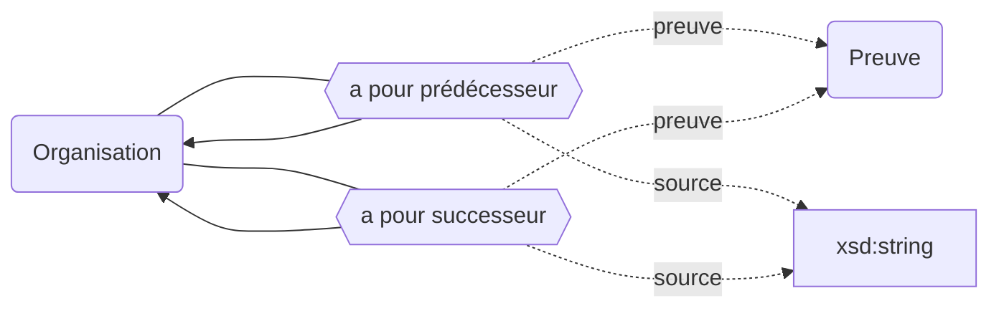
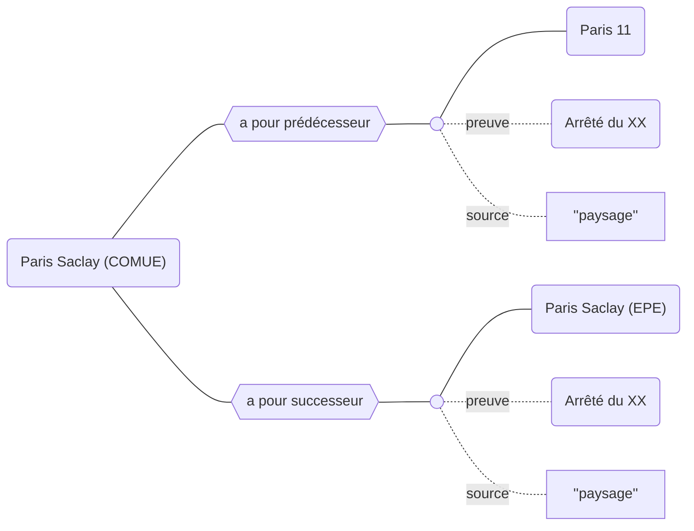

## Modélisation



## Propriétés

| **Propriétés**                                  | ***Domain*** | ***Range***  | ***Cardinalité*** |
| ----------------------------------------------- | ------------ | ------------ | ----------------- |
| à pour prédécesseur <sup>`preuve, source`</sup> | Organisation | Organisation | F/R               |
| à pour successeur <sup>`preuve, source`</sup>   | Organisation | Organisation | F/R               |


## Exemple : Généalogie de l'Université Paris Saclay (COMUE)



## Cas d’usage

### Récupérer la généalogie de l'Université Paris Saclay (COMUE)

Cette requête permet de retrouver les ascendants (Université Paris Saclay EPE) et les déscendants (Paris 11) de l'Université Paris Saclay (COMUE).

```sparql
SELECT DISTINCT ?successeurLabel ?creation ?suppresion
WHERE 
{
  wd:Q8447 (wdt:P52*/wdt:P53*) ?successeur.
  
  ?successeur wdt:P18 ?creation.
  
  OPTIONAL {
   ?successeur wdt:P19 ?suppresion. 
  }
  
  SERVICE wikibase:label { bd:serviceParam wikibase:language "[AUTO_LANGUAGE],en". } # le label viendra de préférence dans votre langue, et autrement en anglais
}
```