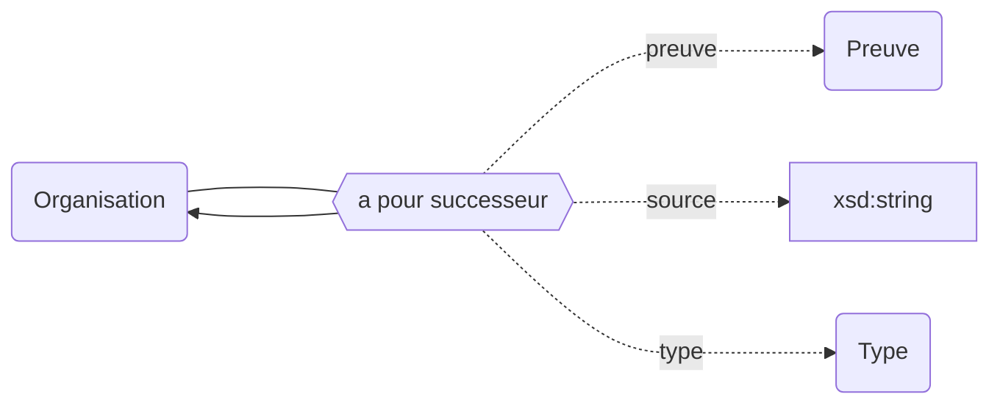

## Modélisation

## Prédécesseurs

## Successeurs

## Propriétés

| **Propriétés**                                                            | ***Domain***                                       | ***Range***                                                       | ***Cardinalité*** | **Qualificatifs**                                                                                                                       |
| ------------------------------------------------------------------------- | -------------------------------------------------- | ----------------------------------------------------------------- | ----------------- | --------------------------------------------------------------------------------------------------------------------------------------- |
| [a pour prédécesseur](../../Ontologie/Propriétés/a%20pour%20prédécesseur.md) | [Organisation](../../Ontologie/Classes/Organisation/) | [Organisation](../../Ontologie/Classes/Organisation/Organisation.md) | F/R               | [`type`](../../Ontologie/Propriétés/type.md), [`preuve`](../../Ontologie/Propriétés/preuve.md), [`source`](../../Ontologie/Propriétés/source.md) |
| [a pour successeur](../../Ontologie/Propriétés/a%20pour%20successeur.md)     | [Organisation](../../Ontologie/Classes/Organisation/) | [Organisation](../../Ontologie/Classes/Organisation/Organisation.md) | F/R               | [`type`](../../Ontologie/Propriétés/type.md), [`preuve`](../../Ontologie/Propriétés/preuve.md), [`source`](../../Ontologie/Propriétés/source.md) |
| [type](../../Ontologie/Propriétés/type.md)                                   |                                                    | Type                                                              | F/NR              | [`preuve`](../../Ontologie/Propriétés/preuve.md), [`source`](../../Ontologie/Propriétés/source.md)                                            |

## Exemple : Généalogie de l'Université Paris-Saclay (COMUE)

<Claim emphase="true" property="a pour prédécesseur">
    <Statement value="Université Paris 11">
        <Qualifier property="preuve">Arrêté du XXX</Qualifier>
        <References>
            <Reference>
                <ReferenceElement property="source">Paysage</ReferenceElement>
            </Reference>
        </References>
    </Statement>
</Claim>

<Claim emphase="true" property="a pour a pour successeur">
    <Statement value="Université Paris-Saclay (EPE)">
        <Qualifier property="preuve">Arrêté du XXX</Qualifier>
        <References>
            <Reference>
                <ReferenceElement property="source">Paysage</ReferenceElement>
            </Reference>
        </References>
    </Statement>
</Claim>
