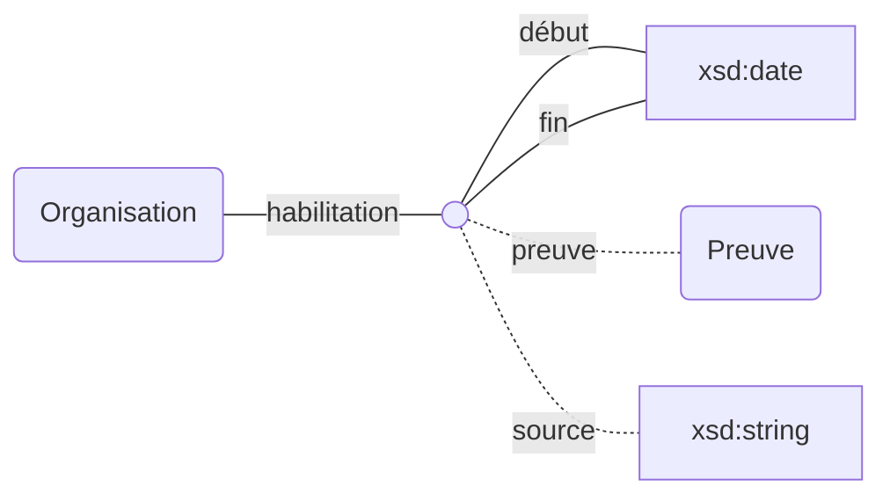
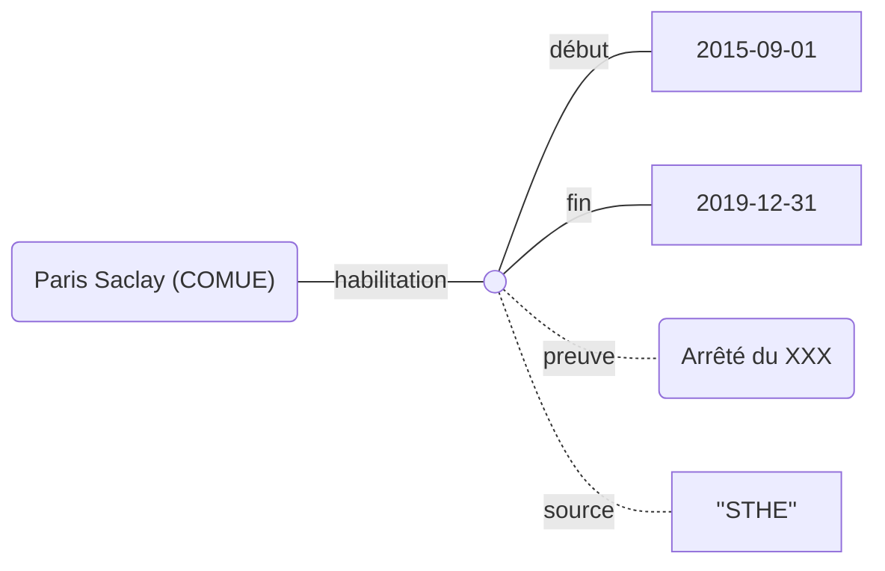

## Modélisation

## Propriétés

| **Propriétés** | ***Domain*** | ***Range*** |
| --- | --- | --- |
| [habilitation doctorale](Propriétés/habilitation%20doctorale.md) `preuve, source, début, fin` | Organisation |  |

## Exemple : L'[habilitation doctorale](Propriétés/habilitation%20doctorale.md) de Paris Saclay (COMUE)

