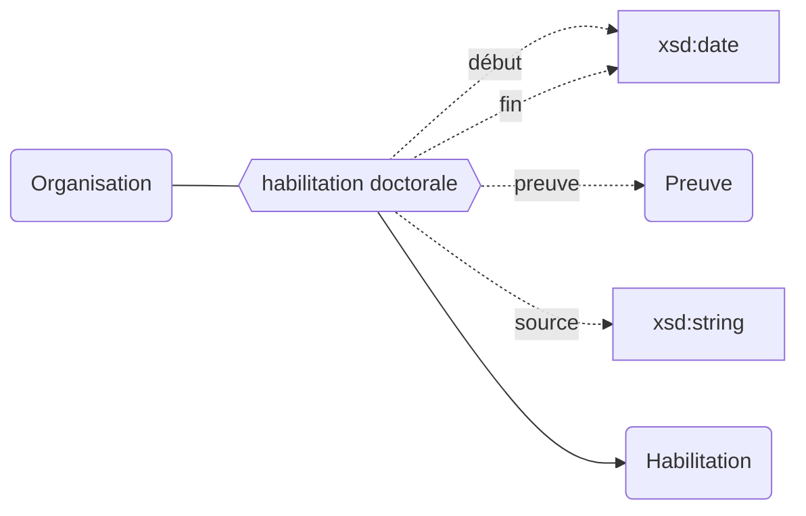
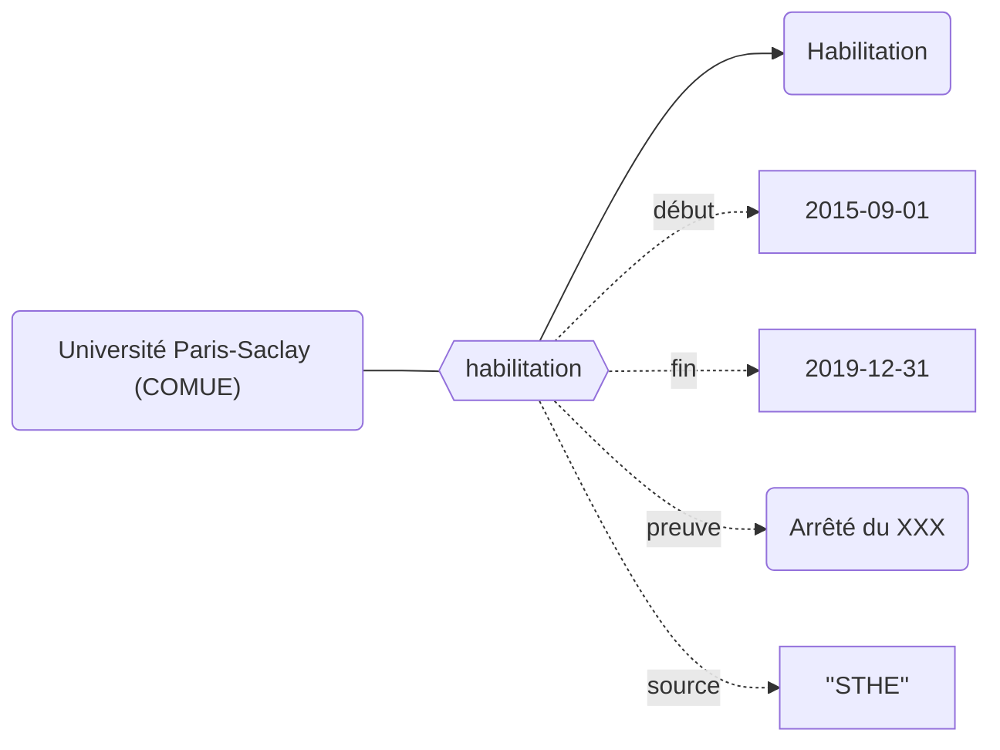

## Modélisation



## Propriétés


| **Propriétés**                                                                                           | ***Domain*** | ***Range*** |
| -------------------------------------------------------------------------------------------------------- | ------------ | ----------- |
| [habilitation doctorale](../Ontologie/Propriétés/habilitation%20doctorale.md) <sup>`preuve, source, début, fin`</sup> | Organisation |             |


## Exemple : L'[habilitation doctorale](../Ontologie/Propriétés/habilitation%20doctorale.md) de Paris-Saclay (COMUE)



## Cas d'usage


### Liste des établissements membre du réseau thèse

```sparql
SELECT ?orgLabel ?code_etablissement WHERE {
  ?org wdt:P1 wd:Q1;
       wdt:P11 ?code_etablissement.
  
  SERVICE wikibase:label { bd:serviceParam wikibase:language "[AUTO_LANGUAGE],en". }
}
```

### Lister les habilitations doctorales

```sparql
SELECT ?orgLabel ?code_etablissement ?debut ?fin WHERE {
  ?org wdt:P1 wd:Q1;
       p:P54 ?habilitation.
  
  OPTIONAL {
    ?org wdt:P11 ?code_etablissement 
  }
  
  OPTIONAL { 
    ?habilitation pq:P12 ?debut.
  }
  
  OPTIONAL { 
    ?habilitation pq:P13 ?fin.
  }
  
  SERVICE wikibase:label { bd:serviceParam wikibase:language "[AUTO_LANGUAGE],en". }
}
```

### Lister les habilitations doctorales en cours

```sparql
SELECT ?orgLabel ?code_etablissement ?debut ?fin WHERE {
  ?org wdt:P1 wd:Q1;
       p:P54 ?habilitation.
  
  OPTIONAL {
    ?org wdt:P11 ?code_etablissement 
  }
  
  OPTIONAL {
    ?habilitation pq:P12 ?debut.
  }
  
  FILTER NOT EXISTS { 
    ?habilitation pq:P13 ?fin.
  }
  
  SERVICE wikibase:label { bd:serviceParam wikibase:language "[AUTO_LANGUAGE],en". }
}
```

### Filiations des environnements thèses de l'Université Paris-Saclay (COMUE)

```sparql
SELECT DISTINCT ?orgLabel ?code_etablissement WHERE {
  wd:Q8447 (wdt:P52*/wdt:P53*) ?org.
  
  ?org wdt:P1 wd:Q1;
       wdt:P11 ?code_etablissement.
  
  SERVICE wikibase:label { bd:serviceParam wikibase:language "[AUTO_LANGUAGE],en". }
}
```
