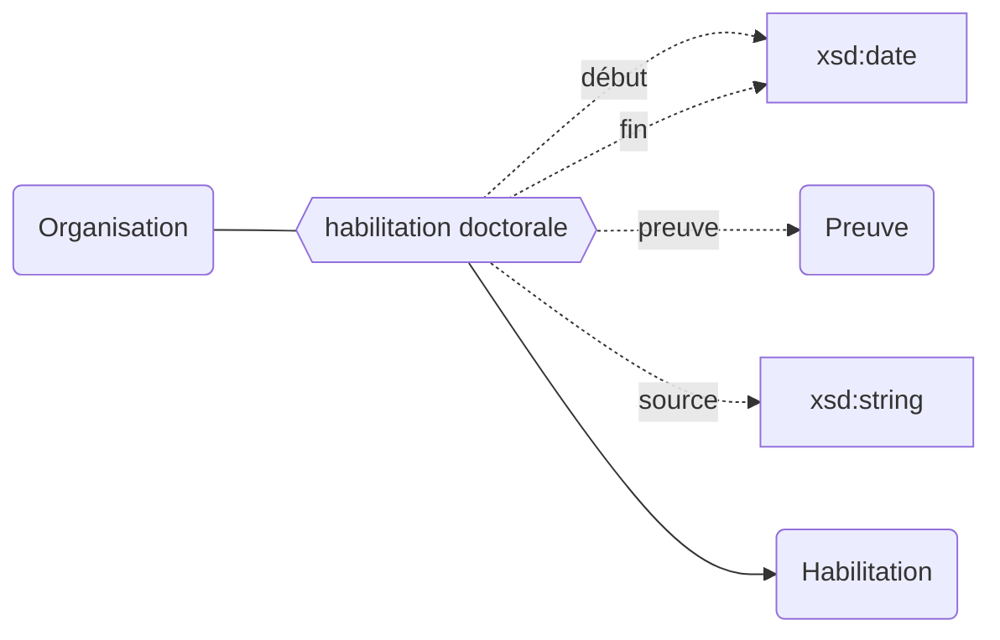

## Modélisation

## Propriétés

| **Propriétés**                                                                | ***Domain***                                                        | ***Range***                                          | **Qualificatifs**                                                                                                                                                                  |
| ----------------------------------------------------------------------------- | ------------------------------------------------------------------- | ---------------------------------------------------- | ---------------------------------------------------------------------------------------------------------------------------------------------------------------------------------- |
| [habilitation doctorale](../../Ontologie/Propriétés/habilitation%20doctorale.md) | [Organisation](../../Ontologie/Propriétés/habilitation%20doctorale.md) | [Habilitation](../../Ontologie/Classes/Habilitation.md) | [`début`](../../Ontologie/Propriétés/début.md), [`fin`](../../Ontologie/Propriétés/fin.md), [`preuve`](../../Ontologie/Propriétés/preuve.md), [`source`](../../Ontologie/Propriétés/source.md) |

## Exemple : L'habilitation doctorale de Paris-Saclay (COMUE)

Université Paris-Saclay (COMUE)

<Claim property="habilitation doctorale">
    <Statement value="Habilitation doctorale">
        <Qualifier property="début">1 septembre 2015</Qualifier>
        <Qualifier property="fin">31 décembre 2019</Qualifier>
        <Qualifier property="preuve">Arrêté du XXX</Qualifier>
        <References>
            <Reference>
                <ReferenceElement property="source">STHE</ReferenceElement>
            </Reference>
        </References>
    </Statement>
</Claim>
